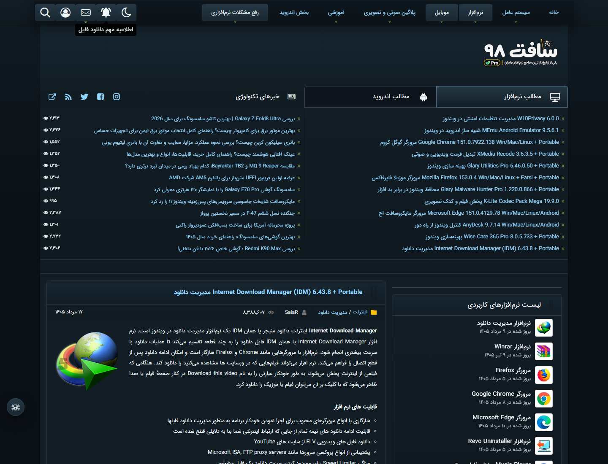

<a id="top"></a>

<div align="center">

<a href="README.md"></a>&nbsp;
<a href="README.fa.md"></a>

<h1>Soft98 Pro</h1>

[](https://github.com/DRSDavidSoft/soft98-pro/releases/latest)
[](https://github.com/DRSDavidSoft/soft98-pro/stargazers)

</div>

<a id="screenshot"></a>

## Screenshot



Soft98 Pro improves Soft98 with resilient ad blocking, anti-adblock patching, download-link recovery, warning cleanup, and a modern dark interface. It is available as both a userscript and browser extensions for Chrome, Edge, and Firefox.

Both formats are built from the shared runtime in [`src/runtime.js`](src/runtime.js), keeping blocking behavior, diagnostics, localization, theming, favicon status, and link recovery aligned.

<a id="contents"></a>

## Contents

- [Screenshot](#screenshot)
- [Features](#features)
- [Bundled Branding](#bundled-branding)
- [Getting Started](#getting-started)
  - [Userscript setup](#userscript-quick-start)
  - [Browser extension setup](#extension-quick-start)
- [Choose a Format](#choose-a-format)
  - [Userscript profile](#userscript-profile)
  - [Browser extension profile](#extension-profile)
- [Updates](#updates)
- [Localization](#localization)
- [Build From Source](#build-from-source)
- [CI/CD](#cicd)
- [Diagnostics](#diagnostics)
- [Documentation](#documentation)

<a id="features"></a>

## Features

- **Ad blocking:** removes ad surfaces through source, shape, size, structure, and link-behavior analysis.
- **Anti-adblock protection:** patches packed Soft98 code before fragile detection logic can damage the page.
- **Download-link recovery:** preserves and restores links when page scripts attempt to disable them.
- **Notice cleanup:** removes intrusive Soft98 and third-party blocker notices without touching article content.
- **Filter-list compatibility:** the extension neutralizes hostile USER-origin pseudo-element warnings using a more-specific USER-origin rule; CI tracks the current PersianBlocker Soft98 rules.
- **Brand repair:** hostile author attributions are replaced with localized Soft98 Pro branding and theme-aware styling using semantic and geometric context instead of generated classes.
- **Dark design:** enables a modern dark reading experience by default.
- **Bilingual interface:** uses Persian when the browser language is `fa` or the timezone is `Asia/Tehran`; otherwise it uses English.
- **Status favicon:** generates a canvas favicon that reflects the current protection state.

<a id="bundled-branding"></a>

## Bundled Branding

- [Light-page logo](docs/assets/soft98-pro-logo-light.png)
- [Pirate-themed Pro logo](docs/assets/soft98-pro-logo-dark.png), carrying the motto `یکی از تبلیغ‌دار ترین مراجع نرم‌افزاری ایران`

The build converts both images to inlined PNG data URLs. After successful cleanup, the runtime heuristically identifies the live site logo and selects the light or pirate Pro variant for the active theme without relying on generated selectors or downloading external assets.

<a id="getting-started"></a>

## Getting Started

Choose one installation path below. The userscript is the shortest setup; the extension provides the fuller browser integration.

<a id="userscript-quick-start"></a>

### Userscript

1. Install [Tampermonkey](https://tampermonkey.net) for Chrome or Edge, or [Violentmonkey](https://violentmonkey.github.io) for Firefox.
2. Install [`soft98-pro.user.js`](https://github.com/DRSDavidSoft/soft98-pro/raw/main/soft98-pro.user.js).
3. Confirm the prompt in your userscript manager.
4. Open [soft98.ir](https://soft98.ir).

[](https://github.com/DRSDavidSoft/soft98-pro/raw/main/soft98-pro.user.js)

<a id="extension-quick-start"></a>

### Browser Extension

1. Download the appropriate ZIP from the [latest release](https://github.com/DRSDavidSoft/soft98-pro/releases/latest).
2. Extract the archive.
3. Follow the instructions for your browser.

#### Chrome or Edge

1. Open `chrome://extensions` or `edge://extensions`.
2. Enable **Developer mode**.
3. Select **Load unpacked**.
4. Choose the extracted Chromium folder.

#### Firefox

1. Open `about:debugging#/runtime/this-firefox`.
2. Select **Load Temporary Add-on**.
3. Choose `manifest.json` from the extracted Firefox folder.

See the complete [Installation Guide](docs/wiki/Installation.md) for package names, browser-specific details, and troubleshooting.

<a id="choose-a-format"></a>

## Choose a Format

<a id="userscript-profile"></a>

### Userscript

- **Best for:** the quickest setup, direct source inspection, and users who already use a script manager.
- **Installation:** one JavaScript file, usually ready in under a minute.
- **Updates:** handled by the userscript manager.
- **Tradeoff:** execution timing and page-world behavior depend on the manager and browser.

<a id="extension-profile"></a>

### Browser Extension

- **Best for:** daily use, richer settings, browser-owned storage, and more predictable integration.
- **Installation:** an unpacked Chromium or Firefox package from the latest release.
- **Updates:** install a newer release package when published.
- **Advantage:** dedicated UI, persistent browser storage, and browser-specific injection paths.

Both formats use the same core protection code. Read the detailed [Userscript vs Extension comparison](docs/wiki/Userscript-vs-Extension.md) before choosing.

<a id="updates"></a>

## Updates

- Userscript managers install updates automatically from `releases/latest/download/soft98-pro.user.js` through standard `@updateURL` and `@downloadURL` metadata.
- The extension checks at installation, browser startup, and every six hours. It prefers `latest.json`, falls back to GitHub's Releases API for older releases, and links directly to the correct Chromium or Firefox package.
- Browser policy prevents a GitHub-hosted unpacked extension from silently replacing itself. Native silent updates require a store or signed distribution channel.

PersianBlocker's current warning is injected as a USER-origin `html::after` rule. The extension can reliably neutralize it at the same CSS origin. The userscript still removes ordinary DOM notices, but a userscript manager cannot outrank another extension's USER-origin stylesheet; install the Soft98 Pro extension when that filter is enabled.

<a id="localization"></a>

## Localization

All English and Persian runtime, settings, diagnostics, taunt, and update copy lives in [`src/messages.json`](src/messages.json). The build validates matching locale keys and inlines the catalog into every target, so the installed userscript and extensions do not fetch translations at runtime.

<a id="build-from-source"></a>

## Build From Source

```bash
git clone https://github.com/DRSDavidSoft/soft98-pro.git
cd soft98-pro
npm ci
npm run ci
```

Generate a fresh live-site screenshot with:

```bash
npm run screenshot
```

### Build Outputs

- [`soft98-pro.user.js`](soft98-pro.user.js): root userscript for direct GitHub installation.
- `dist/userscript/soft98-pro.user.js`: release copy of the userscript.
- `dist/chromium/`: Manifest V3 build for Chrome and Edge.
- `dist/firefox/`: Firefox build with the page-runtime bridge.
- `dist/packages/*.zip`: release-ready installation archives.
- `dist/release/latest.json`: machine-readable update metadata and direct package links.
- `dist/release/SHA256SUMS.txt`: SHA-256 checksums for every release artifact.
- [`docs/assets/soft98-pro-dark.png`](docs/assets/soft98-pro-dark.png): screenshot generated from the live Soft98 harness.

<a id="cicd"></a>

## CI/CD

- **Soft98 Pro CI** builds all targets, runs browser acceptance tests, verifies deterministic packages, performs dependency review, and uploads inspectable artifacts.
- **Soft98 Pro Release** verifies version/tag parity, attests provenance, publishes the GitHub Release, and uploads the extension ZIPs, standalone userscript, metadata, and checksums.
- Both workflows publish branded GitHub step summaries with artifact details and verification results.

<a id="diagnostics"></a>

## Diagnostics

Open DevTools on a Soft98 page and use the public diagnostics API:

```js
window.Soft98AdBlocker.report()
window.Soft98AdBlocker.trapCheck()
window.Soft98AdBlocker.resetHandles()
window.Soft98AdBlocker.events
window.Soft98AdBlocker.stats
```

The friendly alias `window.Soft98Pro` is also available. See the [Diagnostics Guide](docs/wiki/Diagnostics.md) for examples and interpretation.

<a id="documentation"></a>

## Documentation

- [Wiki Home](docs/wiki/Home.md): overview and documentation navigation.
- [Installation](docs/wiki/Installation.md): installation for every supported browser.
- [Userscript vs Extension](docs/wiki/Userscript-vs-Extension.md): detailed format comparison.
- [Diagnostics](docs/wiki/Diagnostics.md): console tools and troubleshooting.
- [Development](docs/wiki/Development.md): build, test, and contribution workflow.
- [Persian README](README.fa.md): complete Persian version of this document.

---

<div align="center">

Soft98 Pro · Userscript and browser extension

[Back to top](#top)

</div>
